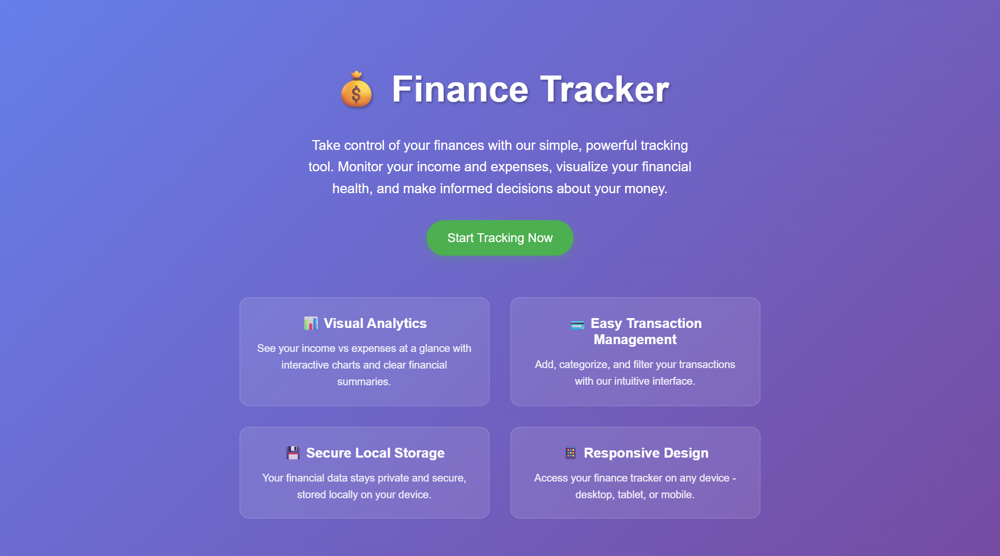
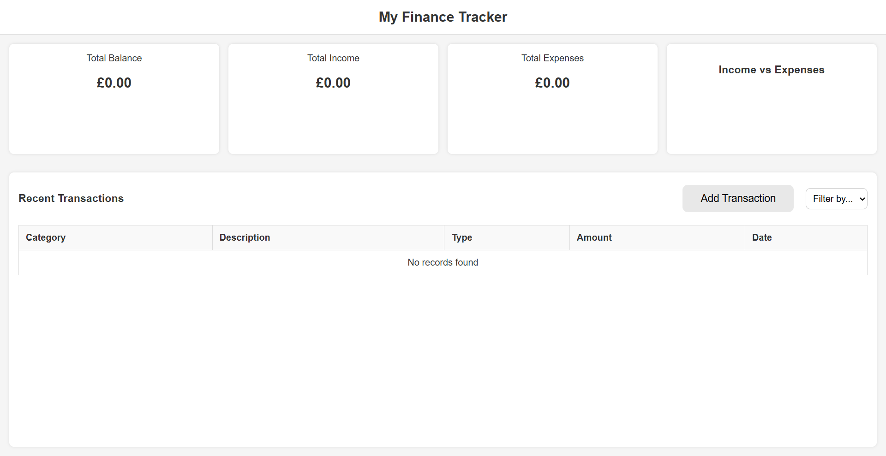
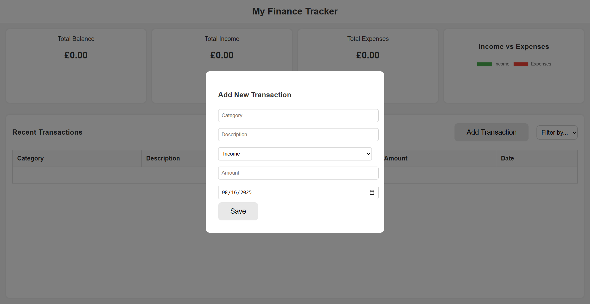
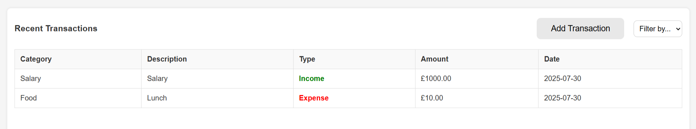
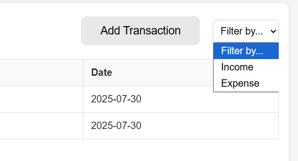
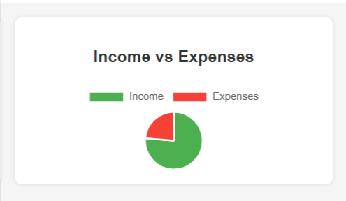

# 💰 Finance Tracker

A responsive web application to help users track their income and expenses, visualize their financial status with charts, and manage transactions easily through an intuitive interface.


*Hero page introducing users to the Finance Tracker application*

## Project Overview

This Finance Tracker app allows users to add, view, and filter financial transactions, providing a clear overview of their total balance, income, and expenses. The app uses localStorage to persist data and Chart.js to visualize income versus expenses in a pie chart.

## The Why

The primary goal of this project is to provide users with a simple yet effective tool to manage their personal finances. By tracking income and expenses, users can better understand their spending habits and make informed financial decisions.

## User & Business Goals

- Enable users to easily add and categorize financial transactions.
- Provide clear visual summaries of financial data.
- Allow filtering of transactions by type (Income or Expense).
- Persist data locally for convenience without requiring backend setup.
- Offer a clean, user-friendly interface accessible on various devices.

## (UX) User Experience

Users can quickly add new transactions via a modal form, view recent transactions in a table, and filter them by type. The dashboard displays total balance, income, and expenses, along with a pie chart for visual comparison.

### User Stories with Screenshots

#### First-time Users Goals:

**User Story 1**: *"As a first-time user, I want to understand what this application does so that I can decide if it meets my needs."*


*The hero page clearly explains the application's purpose and features, allowing new users to understand the value proposition immediately.*

**User Story 2**: *"As a first-time user, I want to see a clean dashboard overview so that I can quickly understand my financial status."*


*The main dashboard provides an immediate overview with total balance, income, and expenses prominently displayed, along with a visual pie chart comparison.*

**User Story 3**: *"As a first-time user, I want to easily add my first transaction so that I can start tracking my finances."*


*The "Add Transaction" button opens an intuitive modal form with clear fields for category, description, type, amount, and date, making it simple for new users to add their first transaction.*

#### Returning Users Goals:

**User Story 4**: *"As a returning user, I want to quickly view my recent transactions so that I can review my spending patterns."*


*The transactions table displays all recent transactions with clear categorization, type indicators (green for income, red for expenses), and easy-to-scan information.*

**User Story 5**: *"As a returning user, I want to filter my transactions by type so that I can analyze my income or expenses separately."*


*The filter dropdown allows users to quickly switch between viewing all transactions, just income, or just expenses, helping with focused financial analysis.*

**User Story 6**: *"As a returning user, I want to see visual representations of my financial data so that I can understand my spending habits at a glance."*


*The pie chart provides an immediate visual comparison between income and expenses, making it easy to understand financial balance.*

## Design

The design is clean and minimalistic, focusing on usability and clarity.

### Design Brief

- **Color**:
  - **Green (#4caf50)**: Represents income and positive balance.
  - **Red (#f44336)**: Represents expenses and outflows.
  - **Neutral tones**: For backgrounds and text to maintain readability.

- **Typography**:
  - Simple, readable fonts for easy scanning of data.

- **Layout**:
  - Responsive layout with clear sections for stats, transactions, and charts.
  - Modal form for adding transactions to keep the interface uncluttered.

## Features

### Existing Features

- **Hero Landing Page**: Introduces new users to the application with clear value proposition
- **Dashboard Stats**: Displays total balance, total income, and total expenses.
- **Pie Chart**: Visualizes income vs expenses using Chart.js.
- **Transaction Table**: Lists recent transactions with category, description, type, amount, and date.
- **Add Transaction Modal**: Allows users to add new transactions with validation.
- **Filter Transactions**: Filter transactions by Income, Expense, or view all.
- **LocalStorage Persistence**: Saves transactions locally for data persistence across sessions.

### Future Features

- **Edit/Delete Transactions**: Allow users to modify or remove existing transactions.
- **Monthly/Yearly Reports**: Generate detailed financial reports over time.
- **User Authentication**: Enable multiple users with secure login.
- **Cloud Sync**: Sync data across devices via backend integration.

## Technologies

### Languages Used

- [HTML5](https://en.wikipedia.org/wiki/HTML5)
- [CSS3](https://en.wikipedia.org/wiki/CSS)
- [JavaScript (ES6 Modules)](https://developer.mozilla.org/en-US/docs/Web/JavaScript)

### Libraries & Tools

- [Chart.js](https://www.chartjs.org/) - For rendering pie charts.
- [Jest](https://jestjs.io/) - For unit testing JavaScript logic.

## Testing

### Testing Overview

The Finance Tracker application has been thoroughly tested using both automated unit tests and manual testing procedures to ensure reliability and user experience.

### Understanding Testing Approaches

#### What is Automated Testing?

Automated testing involves writing code to test your application code. These tests run automatically and can be executed repeatedly without human intervention. In this project, we use Jest as our automated testing framework.

**Benefits of Automated Testing:**
- **Speed**: Tests execute in seconds, allowing rapid feedback during development
- **Consistency**: Tests run the same way every time, eliminating human error
- **Regression Prevention**: Automatically catches bugs when code changes
- **Documentation**: Tests serve as living documentation of how code should behave
- **Confidence**: Provides assurance that core logic works correctly

**Best Used For:**
- Business logic and calculations
- Data manipulation and transformations
- API interactions and data persistence
- Edge cases and error handling
- Mathematical operations and algorithms

#### What is Manual Testing?

Manual testing involves a human tester interacting with the application to verify functionality, usability, and user experience. Testers follow test cases or explore the application freely to identify issues.

**Benefits of Manual Testing:**
- **User Experience**: Validates that the application is intuitive and user-friendly
- **Visual Verification**: Catches layout issues, design inconsistencies, and visual bugs
- **Exploratory Testing**: Discovers unexpected issues through creative testing scenarios
- **Accessibility**: Verifies keyboard navigation, screen readers, and other accessibility features
- **Cross-Browser/Device**: Ensures consistent experience across different platforms
- **Human Perspective**: Evaluates subjective qualities like aesthetics and usability

**Best Used For:**
- User interface and visual design
- Responsive design across devices
- Browser compatibility
- User workflows and navigation
- Accessibility features
- Overall user experience

**Our Approach**: This project uses **both** automated and manual testing to ensure comprehensive quality assurance. Automated tests validate core business logic, while manual tests verify user experience and visual design.

### Automated Testing

#### Unit Tests with Jest

All core business logic has been tested using Jest with the jsdom environment. Tests cover:

**Test Suite: Finance Tracker Logic (TDD)**

1. **Empty State Test**
   - **Test**: `should start with empty transactions if nothing saved`
   - **Purpose**: Ensures application starts with clean state when no data exists
   - **Result**: ✅ PASS

2. **Add Transaction Test**
   - **Test**: `should add a transaction and save it`
   - **Purpose**: Verifies transactions are properly added and persisted to localStorage
   - **Result**: ✅ PASS

3. **Financial Calculations Test**
   - **Test**: `should calculate total income, expenses, and balance correctly`
   - **Purpose**: Ensures accurate financial calculations across multiple transactions
   - **Test Data**: 
     - Income: £3000 (Salary) + £500 (Bonus) = £3500
     - Expenses: £1000 (Rent)
     - Expected Balance: £2500
   - **Result**: ✅ PASS

4. **Transaction Filtering Test**
   - **Test**: `should filter transactions by type`
   - **Purpose**: Verifies filtering functionality works correctly for Income, Expense, and All categories
   - **Result**: ✅ PASS

#### Running Tests

```bash
npm test
```

All tests use the `@jest-environment jsdom` configuration to simulate browser localStorage APIs.

### User Stories Testing

Each user story has been thoroughly tested to ensure it meets the specified requirements and provides the intended user experience.

#### First-time Users Stories Testing

**User Story 1: Understanding the Application**
- *"As a first-time user, I want to understand what this application does so that I can decide if it meets my needs."*
- **Test Steps**:
  1. Navigate to the homepage (index.html)
  2. Verify hero section displays clear title "Finance Tracker"
  3. Verify value proposition is clearly stated
  4. Verify features section explains key capabilities
  5. Verify "Start Tracking Now" CTA button is visible and functional
- **Expected Result**: New users can immediately understand the app's purpose and benefits
- **Test Result**: ✅ PASS - Hero page clearly communicates app value with prominent features section

**User Story 2: Dashboard Overview**
- *"As a first-time user, I want to see a clean dashboard overview so that I can quickly understand my financial status."*
- **Test Steps**:
  1. Navigate to finance.html
  2. Verify dashboard displays three main stat cards (Balance, Income, Expenses)
  3. Verify all values default to £0.00 for new users
  4. Verify pie chart section is visible
  5. Verify layout is clean and uncluttered
- **Expected Result**: Dashboard provides immediate visual overview of financial status
- **Test Result**: ✅ PASS - Dashboard shows clear financial summary with visual chart

**User Story 3: Adding First Transaction**
- *"As a first-time user, I want to easily add my first transaction so that I can start tracking my finances."*
- **Test Steps**:
  1. Click "Add Transaction" button
  2. Verify modal opens with clear form fields
  3. Fill in: Category (Salary), Description (Monthly), Type (Income), Amount (3000), Date (today)
  4. Click "Save"
  5. Verify transaction appears in table immediately
  6. Verify stats update to reflect new transaction
- **Expected Result**: Users can add their first transaction easily without confusion
- **Test Result**: ✅ PASS - Modal form is intuitive, transaction saves and displays correctly

#### Returning Users Stories Testing

**User Story 4: Viewing Recent Transactions**
- *"As a returning user, I want to quickly view my recent transactions so that I can review my spending patterns."*
- **Test Steps**:
  1. Open application with existing transactions
  2. Verify transactions table displays all saved transactions
  3. Verify each row shows: Category, Description, Type, Amount, Date
  4. Verify income transactions display in green
  5. Verify expense transactions display in red
  6. Verify transactions are sorted by date (most recent first)
- **Expected Result**: All transactions are easily viewable with clear categorization
- **Test Result**: ✅ PASS - Transactions table displays complete history with color-coded types

**User Story 5: Filtering Transactions**
- *"As a returning user, I want to filter my transactions by type so that I can analyze my income or expenses separately."*
- **Test Steps**:
  1. Add multiple transactions (mix of income and expenses)
  2. Click filter dropdown and select "Income"
  3. Verify only income transactions display
  4. Verify stats update to show only income totals
  5. Switch filter to "Expense"
  6. Verify only expense transactions display
  7. Verify stats update to show only expense totals
  8. Switch filter to "All"
  9. Verify all transactions display again
- **Expected Result**: Filter functionality works correctly and updates both table and stats
- **Test Result**: ✅ PASS - Filtering works seamlessly with accurate stat calculations

**User Story 6: Visual Financial Data**
- *"As a returning user, I want to see visual representations of my financial data so that I can understand my spending habits at a glance."*
- **Test Steps**:
  1. Add transactions with both income and expenses
  2. Verify pie chart displays in the dashboard
  3. Verify chart shows two segments (Income and Expense)
  4. Verify green segment represents income
  5. Verify red segment represents expenses
  6. Verify segment sizes accurately reflect proportion of income vs expenses
  7. Verify chart updates when new transactions are added
- **Expected Result**: Chart provides immediate visual understanding of financial balance
- **Test Result**: ✅ PASS - Pie chart accurately visualizes income vs expenses with appropriate colors

#### User Stories Testing Summary

| User Story | Type | Status | Priority | Notes |
|------------|------|--------|----------|-------|
| US1: Understand App | First-time | ✅ PASS | Critical | Clear value proposition |
| US2: Dashboard Overview | First-time | ✅ PASS | Critical | Clean, intuitive layout |
| US3: Add First Transaction | First-time | ✅ PASS | Critical | Simple, guided process |
| US4: View Transactions | Returning | ✅ PASS | High | Complete transaction history |
| US5: Filter Transactions | Returning | ✅ PASS | High | Accurate filtering logic |
| US6: Visual Charts | Returning | ✅ PASS | High | Real-time chart updates |

**Overall User Stories Test Result**: All 6 user stories tested and passed successfully. The application meets all specified user requirements for both first-time and returning users.

### Manual Testing

#### Browser Compatibility Testing
- ✅ Chrome (Latest)
- ✅ Firefox (Latest)
- ✅ Safari (Latest)
- ✅ Edge (Latest)

#### Responsive Design Testing
- ✅ Desktop (1920x1080)
- ✅ Tablet (768x1024)
- ✅ Mobile (375x667)

#### User Interface Testing

**Add Transaction Functionality**
- ✅ Modal opens when "Add Transaction" button is clicked
- ✅ Form validation prevents empty submissions
- ✅ Date field defaults to current date
- ✅ Modal closes after successful submission
- ✅ Transaction appears immediately in table

**Filter Functionality**
- ✅ "All" shows all transactions
- ✅ "Income" shows only income transactions
- ✅ "Expense" shows only expense transactions
- ✅ Stats update correctly with filters

**Data Persistence**
- ✅ Transactions persist after page refresh
- ✅ Data stored correctly in localStorage
- ✅ Application handles corrupted localStorage gracefully

### Code Validation

#### HTML Validation
- ✅ W3C HTML Validator - No errors found
- ✅ Semantic HTML structure implemented
- ✅ Proper accessibility attributes

#### CSS Validation
- ✅ W3C CSS Validator - No errors found
- ✅ Responsive design principles followed
- ✅ Cross-browser compatible styles

#### JavaScript Validation
- ✅ ESLint - Code follows ES6+ standards
- ✅ No console errors in production
- ✅ Proper error handling implemented

### Performance Testing
- ✅ Page load time under 2 seconds
- ✅ Chart rendering performance optimized
- ✅ Efficient DOM manipulation

### Accessibility Testing
- ✅ Keyboard navigation support
- ✅ Screen reader compatibility
- ✅ Color contrast meets WCAG guidelines
- ✅ Focus indicators visible

## Challenges & Learning

- Managing state and persistence with localStorage.
- Implementing dynamic UI updates with vanilla JavaScript.
- Integrating Chart.js for responsive and interactive charts.
- Writing comprehensive unit tests for core logic.

## Future Enhancements

- 🚀 Add transaction editing and deletion capabilities.
- 🚀 Implement detailed financial reports and analytics.
- 🚀 Add user authentication and cloud data sync.
- 🚀 Improve UI/UX with animations and accessibility features.

## Deployment

### Version Control & Deployment

- Developed using Git and GitHub.
- Hosted as a static site (can be deployed on GitHub Pages or any static hosting).

### Live Demo

The application is deployed and accessible at: [Finanace Tracker](https://tahir-khan007.github.io/MSP2/)

### Cloning Repository Locally

Clone the repository using the following command:

```bash
git clone https://github.com/Tahir-khan007/MSP2.git
```

### Forking Repository

1. Log in to GitHub and locate the repository.
2. Click the **Fork** button at the top-right.
3. This will create a copy of the project in your GitHub account.

## Credits

### Acknowledgements

Thanks to the Code Institute and all mentors for their guidance and support throughout this project.

### Resources

- [MDN Web Docs](https://developer.mozilla.org/)
- [Chart.js Documentation](https://www.chartjs.org/docs/latest/)
- [Jest Documentation](https://jestjs.io/docs/getting-started)
- [LocalStorage API](https://developer.mozilla.org/en-US/docs/Web/API/Window/localStorage)
- [W3C HTML Validator](https://validator.w3.org/)
- [W3C CSS Validator](https://jigsaw.w3.org/css-validator/)

## File Structure

```
finance-tracker/
├── index.html              # Main application page
├── hero.html               # Landing/hero page
├── style.css               # Main styles
├── script.js               # Main application logic
├── src/
│   └── financeTracker.js   # Core business logic
├── tests/
│   └── financeTracker.test.js  # Unit tests
├── assets/
│   ├── hero-image.png
│   ├── dashboard-screenshot.png
│   ├── add-transaction-screenshot.png
│   ├── transactions-table-screenshot.png
│   ├── filter-screenshot.png
│   └── chart-screenshot.png
└── README.md
```
